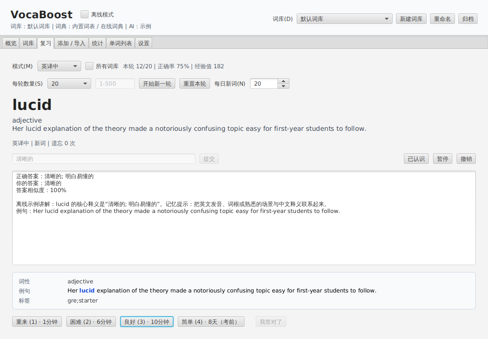
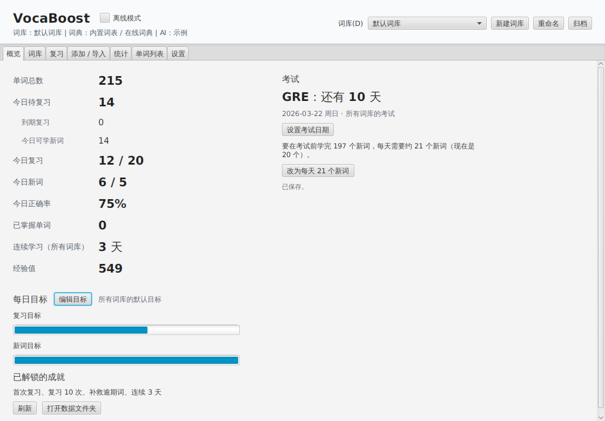
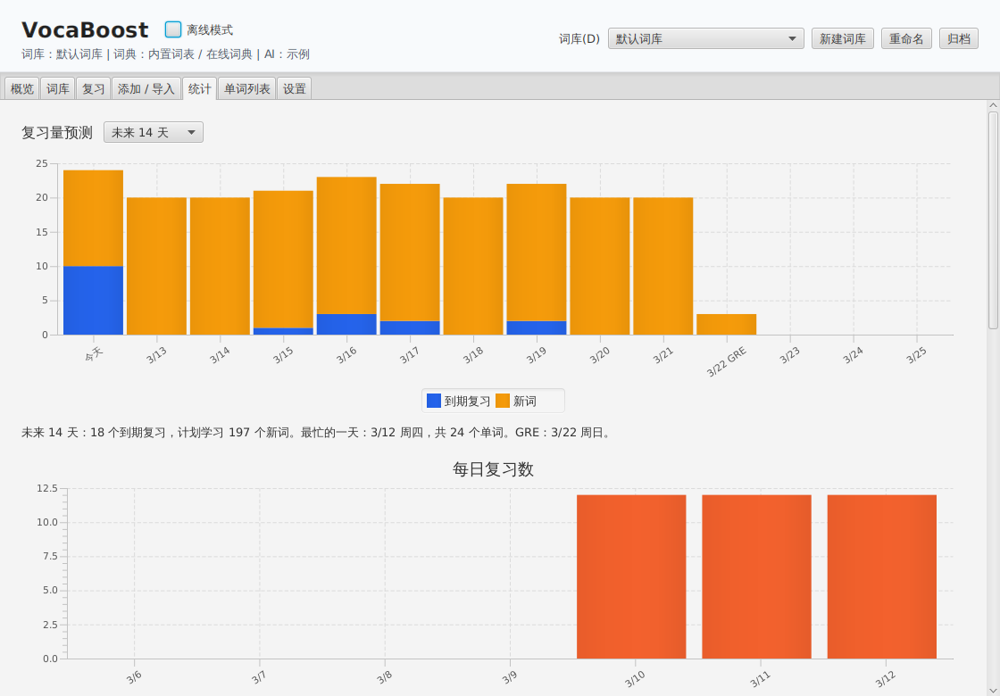
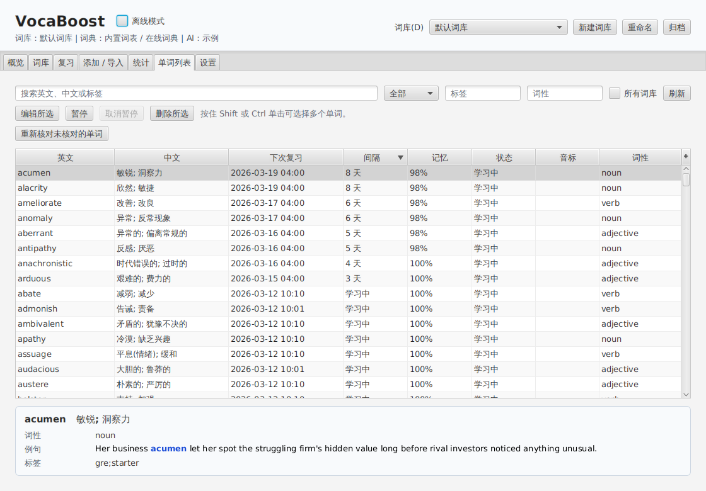
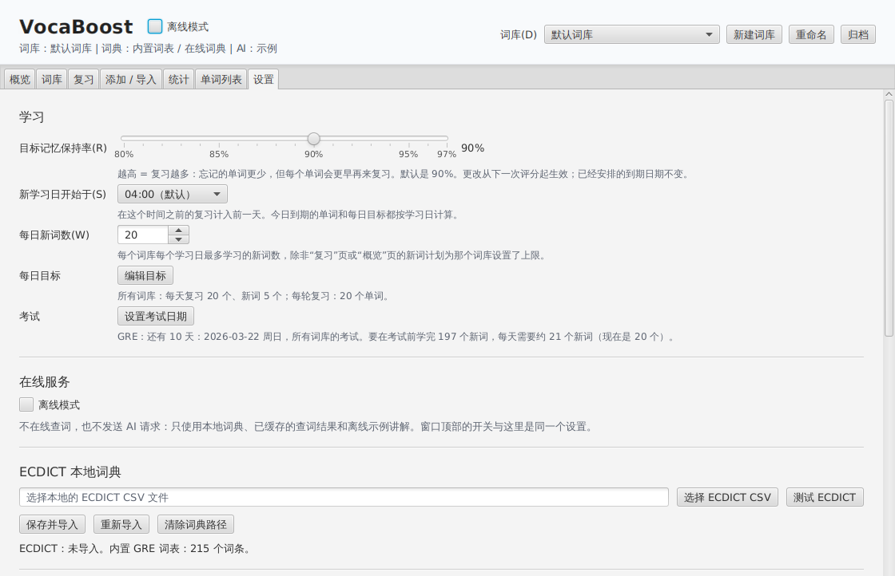
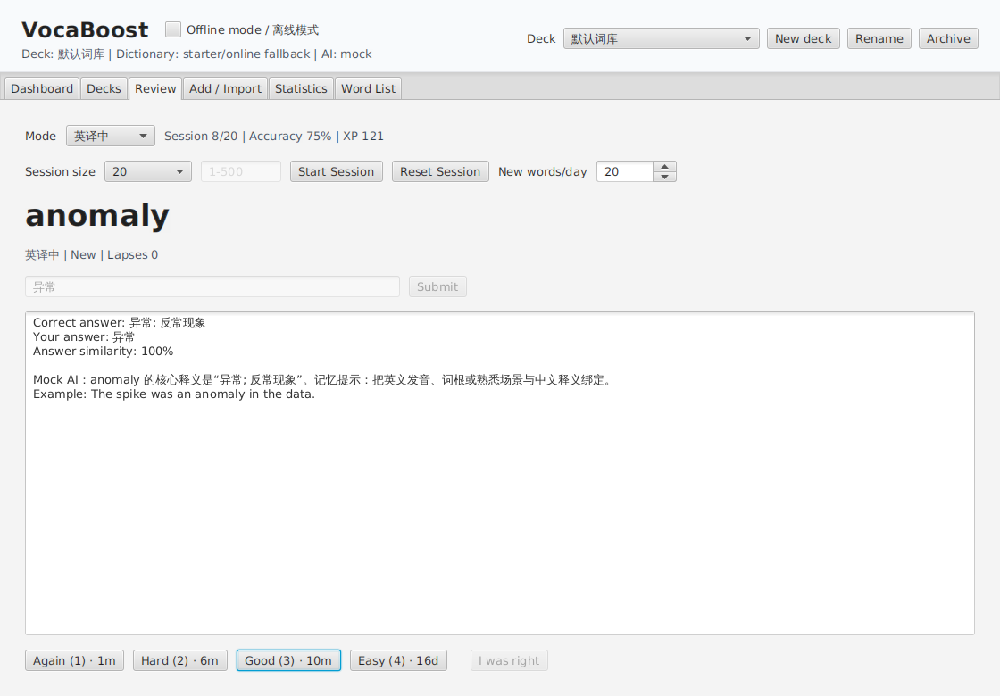
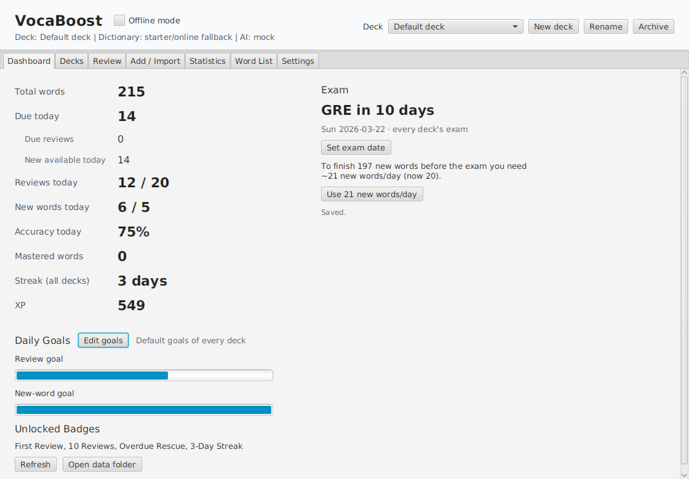
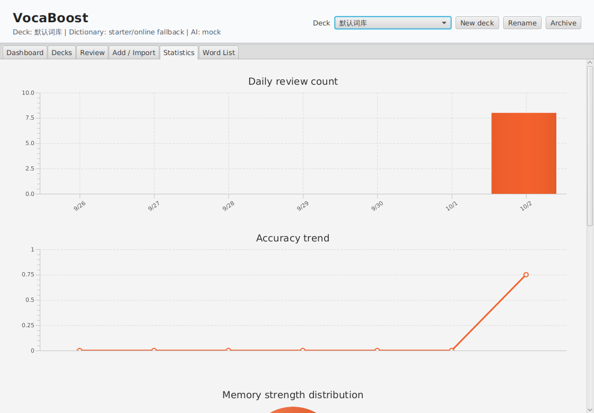
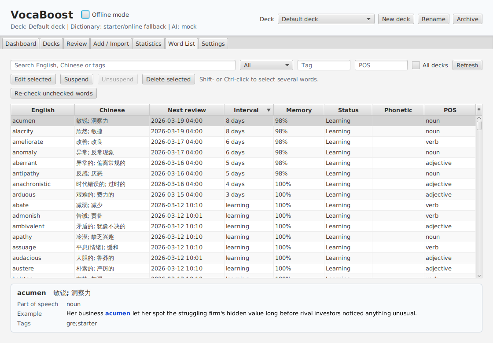
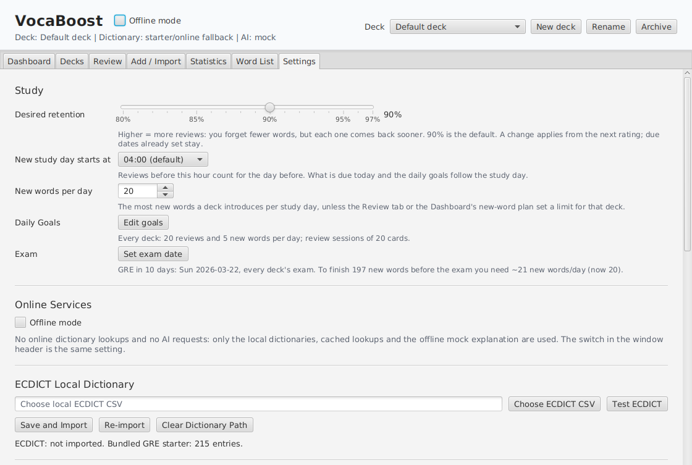

#  VocaBoost

[](https://github.com/bimotan/VocaBoost/actions/workflows/maven-test.yml)

VocaBoost is a desktop vocabulary trainer for Chinese-speaking learners preparing for the GRE (or TOEFL, IELTS, CET and similar exams). You type each answer, the app grades it, and FSRS-5 spaced repetition schedules the next review. Everything lives in a local SQLite database: the app works offline and needs no account. Online dictionaries and an AI explanation provider are optional, and offline mode turns all network access off.

It is written in Java 17 with JavaFX 21, SQLite and Jackson, and builds with the Maven Wrapper. The interface is available in Simplified Chinese and English.

## 中文简介

VocaBoost 是一款面向中文母语 GRE 考生的桌面背单词软件（也适用于托福、雅思、四六级等考试）。复习时需要输入答案：英译中输入中文释义，中译英和例句填空输入英文单词。程序按方向判分（中文释义比较字词相似度，英文拼写允许少量拼写错误），再用 FSRS-5 间隔重复算法安排下次复习。所有数据保存在本机的 SQLite 数据库中，无需注册账号，离线也能使用。

- **学习**：FSRS-5 调度（含学习步骤）；新学习日从凌晨 4 点开始；评分按钮上显示每个评分对应的复习间隔；英译中、中译英、混合、薄弱词、例句填空五种模式；判分有误时可点“我答对了”；支持撤销、暂停、标记为已认识；可以一次复习所有词库。
- **规划**：每日目标、连续学习天数、考试倒计时与新词计划、未来 14 / 30 天复习量预测、统计图表、Markdown 学习报告。
- **单词**：多词库；可导入 ECDICT 本地词典，并按 GRE、托福等考试标签建词库；在线查词，显示近义词、反义词并播放发音；支持导入 Anki、CSV、TSV 和纯单词列表（可预览并映射列），可导出为 Anki 文件；提供 CSV / JSON 备份，数据库每天自动快照。
- **AI（可选）**：可接入任意 OpenAI 兼容接口来讲解答案，默认只在答错后自动讲解；离线模式下不发出任何网络请求。
- **界面**：简体中文 / 英文界面（在“设置”中切换，重启后生效），支持全键盘复习，适配小屏笔记本，可调字号并支持读屏软件。

快速开始：安装 JDK 17 或更新版本，然后运行 `./mvnw javafx:run`（Windows 上运行 `mvnw.cmd javafx:run`）。数据位置、隐私说明和构建命令见下文。

## Screenshots

Taken from the real window by a UI test (see [Build and test](#build-and-test)), after three days of reviews on the bundled starter words and with an exam date set.

| 复习 Review | 概览 Dashboard |
|---|---|
|  |  |
| **统计 Statistics** | **单词列表 Word List** |
|  |  |
| **设置 Settings** | |
|  | |

<details>
<summary>The same tabs in English</summary>

| Review | Dashboard |
|---|---|
|  |  |
| **Statistics** | **Word List** |
|  |  |
| **Settings** | |
|  | |

</details>

## Features

### Learning

- **FSRS-5 scheduling** with its published default parameters, learning steps of 1 and 10 minutes, a 10-minute relearning step and a desired retention you can set from 80% to 97%. A study day starts at 4 am by default, so a review after midnight still counts for the evening before.
- **Interval previews**: every rating button shows the interval it would give, e.g. `Good (3) · 4d`.
- **Typed answers, graded per direction.** English → Chinese compares your meaning with each listed meaning (part-of-speech markers, brackets and punctuation are ignored). Chinese → English allows about one typo per five letters, and it rejects confusable words such as affect/effect. The check caps what your rating counts as (a wrong answer counts as Again); if the check is wrong, **I was right** lifts the cap for that answer.
- **Modes**: English → Chinese, Chinese → English, Mixed, Weak Words (practises weak words without stretching their intervals) and **Cloze**, which blanks the word and its inflected forms in the example sentence.
- **Undo** (Ctrl+Z / Cmd+Z) for ratings and other review actions, **Suspend**, and **Already known** for new words you know already.
- **Sessions** of 10, 20, 50, all due or a custom number of cards, with a daily new-word limit per deck, or an **All decks** session that reviews the due words of every deck at once.
- 215 bundled GRE-style starter words, each with an original example sentence, imported once into a new database.

### Planning

- **Daily goals** (reviews and new words, for every deck or one deck), XP, badges and a **streak** across all decks.
- **Exam date** for every deck or one deck: a countdown on the Dashboard and a new-word plan ("you need ~28 new words/day"). Reviews that would fall after the exam are moved before it.
- **Workload forecast** for the next 14 or 30 days: reviews already scheduled, plus the new words planned.
- **Statistics**: daily reviews, accuracy trend, memory (chance of recall now), hardest words and overdue words. Export a **Markdown learning report**.

### Words and data

- **Decks**: create, rename, archive and restore them. Active deck names are unique, ignoring case.
- **ECDICT**: import the free ECDICT dictionary CSV once into its own SQLite file (`ecdict.db`). After that, lookups and word-only imports work offline, and you can build a deck from the words ECDICT tags with an exam (GRE, TOEFL, IELTS, CET-4/6, 考研, 高考, 中考).
- **Dictionary lookups** run in the background: first ECDICT and the starter words, then a private dictionary API if you configured one, then dictionaryapi.dev and Wiktionary, asked together with a 6-second deadline. A word the dictionaries do not have is reported differently from a dictionary that could not be reached (network error, timeout, rate limit, ...). Words added while the dictionaries could not be reached are tagged `UNCHECKED`. You can find them with the Unchecked filter and check them again later.
- **Word details**: phonetic, part of speech, example with the word highlighted, note and tags; **synonyms, antonyms and pronunciation playback** from dictionaryapi.dev. The Word List can search, filter, sort and edit words, and it can list every deck at once.
- **Import**: CSV, TSV, Anki plain-text exports and lists of English words. VocaBoost detects UTF-8, UTF-16 and GBK files, and the preview lets you choose which column holds what. Word-only lists get their meanings from ECDICT. When an import adds words that other decks have, it asks whether to copy their meanings. Legacy text files can be imported too.
- **Export**: Export for Anki (TSV), a word list (txt), words and review logs as CSV (Excel-friendly UTF-8), and a per-deck **JSON backup**. A backup can be restored into the current deck (keeping its progress or using the backup's) or into a new deck.
- **Automatic snapshots** of the database: before an upgrade, before each backup restore, and once a day. The newest 10 are kept.

### AI explanations (optional)

- Any **OpenAI-compatible** chat-completions endpoint (base URL, API key, model, optional temperature) can explain a checked answer: the meaning, what your answer was confused with, a memory tip and an example. Explanations are cached per word and answer.
- **Explain automatically**: after every answer, only after a mistake (the default) or never. The Explain button asks on demand, and Regenerate asks again. A failed request shows the reason (key refused, model not found, rate limited, timeout, ...) and falls back to a built-in offline explanation.
- Without a provider, or in **offline mode**, the app shows the offline explanation and sends nothing.

### App

- **Simplified Chinese and English** interface. *Auto* follows the system language, and a change applies when the app starts again.
- **Keyboard review**: Enter submits, 1–4 rate Again / Hard / Good / Easy, Space confirms the suggested rating, and Ctrl+Z undoes.
- **Small screens**: the window fits a 1366 × 768 laptop and can shrink to 960 × 640, and the rating buttons always stay in view.
- **Accessibility**: every field has a label for screen readers, form labels have Alt mnemonics, text colours meet WCAG AA contrast, and text can be shown at 100%, 115% or 130%.

## Quick start

You need a **JDK 17 or newer** (for example Temurin 17 or 21). The Maven Wrapper downloads the right Maven version, so you do not need to install Maven.

```bash
git clone https://github.com/bimotan/VocaBoost.git
cd VocaBoost
./mvnw javafx:run          # Windows: mvnw.cmd javafx:run
```

The first start creates the database, imports the 215 starter words into the default deck and opens the Dashboard. The Review tab already shows the first card.

Optional setup, all on the **Settings** tab:

- **ECDICT**: download `ecdict.csv` from the [ECDICT project](https://github.com/skywind3000/ECDICT), then use **Choose ECDICT CSV**, **Test ECDICT** and **Save and Import**. It is imported once, in the background, and you can delete the CSV afterwards. `ECDICT_CSV_PATH` works as a fallback when no path is saved.
- **AI provider**: enter a base URL (for example `https://api.openai.com/v1`; `/chat/completions` is added), an API key and a model, then click **Save AI Settings** and **Test AI Explanation**. Instead of saving the key, you can set `VOCABOOST_AI_BASE_URL`, `VOCABOOST_AI_API_KEY`, `VOCABOOST_AI_MODEL` and optionally `VOCABOOST_AI_TEMPERATURE`.
- **Private dictionary API** (advanced): set `DICTIONARY_API_BASE_URL` (and optionally `DICTIONARY_API_KEY`) before starting. The app then sends `GET {base URL}?word=...` before it asks the public dictionaries.
- **Language** and **text size**: in the Language and Display sections.

Pronunciation playback uses JavaFX Media and needs a sound device. On Linux, playing mp3 recordings needs the system's FFmpeg (libavcodec) libraries; without them the app says that the recording cannot be played.

## Where your data lives

Everything is kept in one folder, `.vocab-trainer`, in your home folder:

| | Windows | macOS | Linux |
|---|---|---|---|
| Data folder | `%USERPROFILE%\.vocab-trainer\` | `~/.vocab-trainer/` | `~/.vocab-trainer/` |

| File or folder | What it holds |
|---|---|
| `vocab.db` | Words, decks, reviews, goals and settings (including a saved API key). While the app runs, SQLite also keeps `vocab.db-wal` and `vocab.db-shm` next to it. |
| `ecdict.db` | The imported ECDICT dictionary, kept apart so that `vocab.db` and its backups stay small. |
| `logs/vocaboost-0.log` | Diagnostic log, rotated over 5 files of 1 MB. |
| `snapshots/vocab-<date>-<time>-<reason>.db` | Automatic copies of `vocab.db` (`daily`, `before-restore`, `before-upgrade-v<N>`). The newest 10 are kept. |

**Settings → Data and Logs** has buttons that open the data, log and snapshots folders. The buttons open the folders without showing their paths on screen. Copy `vocab.db` only while the app is closed.

Older databases are upgraded in place at startup by numbered schema steps, each in one transaction, and a snapshot is written first. **To go back to a snapshot:**

1. Close VocaBoost.
2. Delete `vocab.db-wal` and `vocab.db-shm` from the data folder, if they are there.
3. Copy the snapshot into the data folder as `vocab.db`, replacing the current file.
4. Start VocaBoost again.

Everything you changed after the snapshot is lost, so export a JSON backup first if you want to keep it.

## Privacy

VocaBoost has no account, telemetry or update check, and it sends nothing when it starts. It only goes online when you do one of these things:

| What you do | What is sent, and where |
|---|---|
| Look up or add a word that the local dictionaries (ECDICT, starter words) do not have | The English word to `api.dictionaryapi.dev` and `en.wiktionary.org`, and to `DICTIONARY_API_BASE_URL` if you set one. Public results are cached locally for 30 days. |
| Re-check unchecked words; import a word list with "Look up meanings the local dictionary does not have online too" ticked; click "Look up synonyms and pronunciation online" | The same dictionary requests, one per word. |
| Press ▶ next to a phonetic | The recording is downloaded from the address dictionaryapi.dev gave for it. |
| Check an answer while an AI provider is configured (as "Explain automatically" decides), or press Explain, Regenerate, Get a mnemonic or Test AI Explanation | The word, its meaning, part of speech and example, the question direction and your typed answer, to the base URL you configured. |

- **Offline mode** (the switch in the window header, or on the Settings tab) stops all of the above. The app then uses only ECDICT, the starter words, cached lookups and the offline explanation.
- **API key storage is a deliberate trade-off.** A key saved in Settings is stored **as plain text in `vocab.db`**. Encrypting it would mean keeping the means to decrypt it in the same place, so it would give no real protection. The app never shows the key again, never writes it to logs, exports or JSON backups, sends it only over https (or plain http to `localhost`), and never follows redirects with it. If you do not want the key in the database, set `VOCABOOST_AI_API_KEY` instead. Treat `vocab.db` and its snapshots like a password file when you share or sync them.
- **Data folder permissions**: on Linux and macOS the app makes `~/.vocab-trainer` readable by your account only (mode 700) at startup. On Windows the folder sits in your user profile, which other accounts cannot open by default.

## Build and test

All commands run from the project root. On Windows use `mvnw.cmd` instead of `./mvnw`.

| Command | What it does |
|---|---|
| `./mvnw test` | Unit and integration tests, without the JavaFX UI tests. |
| `./mvnw verify` | Also runs the enforcer rules (Java and Maven versions, pinned plugins, dependency convergence, duplicate classes) and fails if line coverage of the service and repository code drops below 60%. It builds the jar too. The coverage report is in `target/site/jacoco/index.html`. |
| `./mvnw verify -Pui-tests` | Also runs the UI tests, which open the real window with scripted dialogs and no network access. They save PNG snapshots of the window to `target/ui-snapshots/`. |
| `xvfb-run -a -s "-screen 0 1400x900x24" ./mvnw verify -Pui-tests` | The same on Linux without a display. |
| `xvfb-run -a -s "-screen 0 1400x900x24" ./mvnw test -Pscreenshots` | Takes the screenshots in `docs/screenshots` again (`DocsScreenshotsUiTest`). |
| `./mvnw package -DskipTests`<br>`java -jar target/vocab-trainer-1.0.0.jar` | Builds the jar, with its runtime jars in `target/lib/`, and starts it. The JavaFX jars are for the OS you build on. |
| `java -jar target/vocab-trainer-1.0.0.jar --smoke-test` | Starts the app on a new database in a temporary folder (your data is never opened). It waits until the main window shows without errors, then exits with 0, or exits with 1 and says why. |

The tests run on fixed clocks, so they give the same results at any hour and in any time zone.

### Packaging

The packaging scripts build with the wrapper (tests included unless you skip them), trim the Java runtime with jdeps and jlink, and run jpackage. The app image is about 80 MB. jpackage can only build for the OS it runs on.

```bash
# Linux (app image, or --type deb|rpm) and macOS (--type dmg|pkg)
scripts/package.sh [--type app-image] [--skip-tests]
scripts/smoke-test.sh target/dist/VocaBoost/bin/VocaBoost          # Linux without a display: prefix xvfb-run -a -s "-screen 0 1400x900x24"
```

```powershell
# Windows: target\dist\VocaBoost\VocaBoost.exe; -PackageType exe|msi needs the WiX Toolset
.\scripts\package-windows.ps1 [-PackageType app-image] [-SkipTests] [-Console]
.\scripts\smoke-test.ps1 target\dist\VocaBoost\VocaBoost.exe
```

The smoke-test scripts start the packaged launcher with `--smoke-test` and fail on a non-zero exit code or a timeout. macOS packaging is supported by `scripts/package.sh` but not tested in CI, and the app is not signed.

### Continuous integration and releases

- [`maven-test.yml`](.github/workflows/maven-test.yml) runs on pushes and pull requests to `main`:
  - `./mvnw -B -ntp verify` on Windows and Ubuntu with JDK 17 and 21.
  - All tests including the UI tests under xvfb, in a time zone where it is 1 am. That is between midnight and the 4 am study-day rollover, where date bugs show up. This job uploads the UI snapshots and the coverage report.
  - Both packaging scripts, and a smoke test of the Windows and Linux app images.
- [`release.yml`](.github/workflows/release.yml): pushing a tag `v<version>` that matches `<version>` in `pom.xml` builds, tests, packages and smoke-tests the Windows app image. It then attaches the image as a zip, with its SHA-256, to that tag's GitHub release.
- Dependabot proposes Maven and GitHub Actions updates weekly.

## Architecture

Plain layers, with no JavaFX in the business logic:

```text
src/main/java/com/vocabtrainer
├── app          startup, the --smoke-test argument, service wiring (AppServices)
├── ui           programmatic JavaFX (no FXML): MainWindow and one package per tab
│                (dashboard, decks, review, importing, stats, words, settings)
├── service      scheduling (FSRS), answer grading, review sessions, goals, exam planning,
│                dictionaries, AI, import/export (csv, wordlist, ecdict, cloze)
├── repository   SQLite schema and migrations, connection pool, transactions, snapshots
├── domain       WordCard, Deck, ReviewLog, goals, dictionary and statistics records
└── util         messages (i18n), logging, data folder, local date and time
```

- The review flow lives in `ReviewSessionPresenter`, which has no JavaFX dependency. The view only renders it.
- Views never refresh each other. Changes are published as events, and a hidden tab is recomputed only when it is shown.
- Slow work (lookups, imports, AI) runs off the JavaFX thread, and results that arrive too late are dropped.
- SQLite runs in WAL mode with pooled connections. Multi-step writes (a rating, an import, a restore) are single transactions, and the schema is versioned with `PRAGMA user_version`.
- Times are stored as local wall-clock time, a deliberate choice for a single-user desktop app.
- Every UI text is in the `messages.properties` and `messages_zh_CN.properties` bundles.

[docs/ARCHITECTURE.md](docs/ARCHITECTURE.md) documents each part in detail, including the design decisions. [docs/ROADMAP.md](docs/ROADMAP.md) lists what is done and what is next.

Other folders: `src/test` (unit, repository and UI tests), `samples/` (legacy import files), `scripts/` (packaging and smoke tests), `packaging/icons/` (app icon sources), `docs/` (architecture, roadmap and screenshots).

## License

[MIT](LICENSE)
